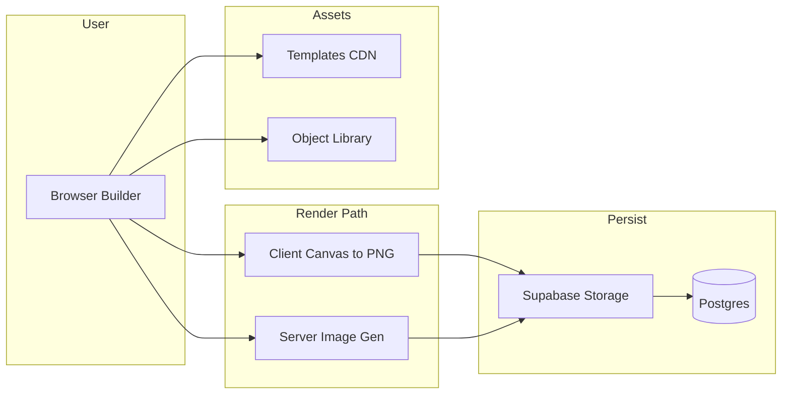
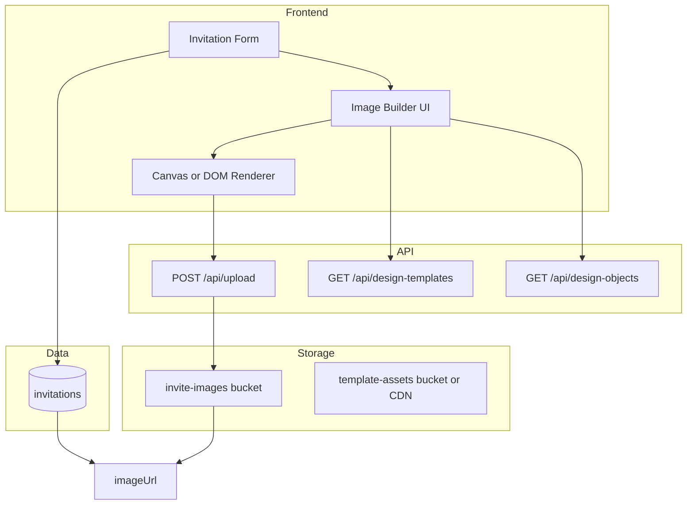

# Invite Image Builder — Design, Architecture & Plan

## 1. Feature Concept

**Goal:** Let users create the **cover image** for their invitation inside the app instead of only uploading a photo or pasting a URL. They start from a standard template (e.g. wedding, birthday, party), add/place text and decorative objects, optionally add a photo, and **generate a final image** that becomes `invitation.imageUrl`.

**User flow (high level):**

1. In “Create invitation” or “Edit invitation,” user chooses **Cover image** source: **Upload / URL** (current) or **Design with template**.
2. If “Design with template”: open an **image builder** (modal or dedicated page).
3. **Pick a base template** from a gallery (e.g. “Wedding floral,” “Birthday minimal,” “Party bold”) — each template is a starting layout (background, default positions, event type).
4. **Customize:** add/edit text blocks (event name, date, tagline), place **objects** (icons, shapes, borders, clipart by event type), optionally **add a photo** (user upload) into the design.
5. **Preview** the card in real time; optionally adjust canvas size/aspect ratio.
6. **Generate image:** produce a raster image (e.g. PNG/JPEG), upload it to your storage, and set `invitation.imageUrl` to that URL (or save a “design config” and generate on publish — see options below).

**Desievite-style outcome:** A single, shareable invite image (like [public/invite-image.jpg](public/invite-image.jpg)) that the user generated from template + text + objects + optional photo.

---

## 2. What Is Needed (Product & Content)


| Need                      | Description                                                                                                                                                                                                      |
| ------------------------- | ---------------------------------------------------------------------------------------------------------------------------------------------------------------------------------------------------------------- |
| **Template gallery**      | 5–15 base “card” templates (e.g. wedding, birthday, party, generic). Each has: background (image or gradient), default layout (slots for title, subtitle, date, optional photo), aspect ratio (e.g. 4:5 or 1:1). |
| **Event types / themes**  | Event type (e.g. wedding, birthday, baby shower, party) drives which **object library** and default copy are offered. Can map 1:1 to template category or be separate.                                           |
| **Object library**        | Decorative assets: icons, shapes, borders, clipart, dividers. Organized by event type or tag. Format: SVG (preferred for scale) or PNG. Rights-cleared for your app.                                             |
| **Text layers**           | User-editable text blocks: title, subtitle, date line, tagline. Font choices (from a curated list), size, color, position. Templates define default positions and fonts.                                         |
| **Photo slot (optional)** | One (or more) “photo” placeholders in the template; user uploads an image that gets cropped/positioned (e.g. circle, rounded rect).                                                                              |
| **Canvas / output spec**  | Fixed output size (e.g. 1080×1350 px for 4:5) so the generated image looks good on social and in the invite layout.                                                                                              |


**Content creation:** Templates and object library can be designed in Figma/Illustrator and exported (SVG/PNG), or you use a designer; budget one-time or per-template cost. Fonts: use licensed web fonts (e.g. Google Fonts, Adobe Fonts) and document license for “embed in generated images.”

---

## 3. Data Model & Storage

**Option A — Store generated image only (simplest)**  

- User designs in the builder → you **generate one image** → upload to Supabase Storage → set `invitation.imageUrl`.  
- No new DB fields.  
- **Con:** User cannot re-edit the “design” later; they only re-upload or design again.

**Option B — Store design config and generate on demand**  

- New field: `invitation.designConfig` (JSON) describing template id, text layers (content + position + style), object placements, optional photo reference).  
- **Generate image** when: user clicks “Apply to invite,” or when the public invite page is rendered (e.g. server-side or edge).  
- **Pro:** Re-editable; can change text without losing layout. **Con:** Requires a reliable, fast image-generation path (server or edge).

**Option C — Hybrid**  

- Store both `designConfig` (for editing) and `imageUrl` (cached result). When user edits design, regenerate and overwrite `imageUrl`; optional TTL or “regenerate” button.

**Design config schema (conceptual):**

```json
{
  "templateId": "wedding-floral",
  "canvas": { "width": 1080, "height": 1350 },
  "textLayers": [
    { "id": "title", "text": "We're Getting Married", "x": 0.1, "y": 0.2, "fontFamily": "Cormorant", "fontSize": 48, "color": "#1a1a1a" }
  ],
  "objects": [
    { "id": "obj-1", "assetId": "floral-corner", "x": 0, "y": 0, "scale": 1 }
  ],
  "photoSlot": { "url": "https://...", "x": 0.2, "y": 0.4, "width": 0.6, "height": 0.4, "shape": "circle" }
}
```

**New storage:**  

- **Template assets:** Background images, default SVGs — in Supabase Storage (e.g. `template-assets/`) or CDN; keyed by `templateId`.  
- **Object library:** SVGs/PNGs in Storage or CDN; keyed by `assetId` / event type.  
- **Generated images:** Already covered by `invite-images` bucket; builder output is just another upload.

**DB change (if Option B or C):**  

- Add `design_config Json?` to [prisma/schema.prisma](prisma/schema.prisma) on `Invitation` (and optionally a `design_config_version` for cache busting).  
- Keep `image_url` as the final cover image URL (used everywhere today).

---

## 4. Architecture Options




**Option 1 — Client-side only (canvas to image)**  

- Builder UI in the browser: canvas (e.g. HTML5 Canvas, Fabric.js, Konva.js) or DOM/CSS layout.  
- User edits; you draw template + text + objects (and optional user photo) on the canvas.  
- **Export:** `canvas.toDataURL('image/png')` or use `html2canvas`; upload the data URL to your upload API (e.g. base64 → Storage).  
- **Pro:** No server image pipeline; simple. **Con:** Fonts and assets must load in browser; quality/consistency depend on device; no server-side “preview” for emails etc.

**Option 2 — Server-side image generation**  

- Store only `designConfig`. When you need the image (e.g. “Apply to invite” or “Publish”), call a **server/edge function** that:  
  - Loads template + objects from URLs,  
  - Renders text and layers (e.g. Node Canvas, Sharp, Puppeteer, or a service like Cloudinary or imgix).  
  - Outputs PNG/JPEG → upload to Storage → set `imageUrl`.
- **Pro:** Consistent quality, one source of truth, possible to generate different sizes. **Con:** Backend complexity, cold starts, and cost (compute, possibly third-party).

**Option 3 — Hybrid**  

- **Edit path:** Client-side builder; user sees live preview in canvas.  
- **Publish path:** Submit `designConfig` to API; server generates final image once, uploads to Storage, returns `imageUrl`; save both `designConfig` and `imageUrl` on invitation.  
- Re-edit: load `designConfig` into builder again; on save, regenerate image and update `imageUrl`.

**Recommendation:** Start with **Option 1** (client-only) for MVP: faster to ship, no new backend image pipeline. Move to **Option 3** if you need consistent output, server-side previews, or email thumbnails.

---

## 5. Technical Building Blocks


| Layer               | Options                                                                         | Notes                                                                                                         |
| ------------------- | ------------------------------------------------------------------------------- | ------------------------------------------------------------------------------------------------------------- |
| **Canvas / editor** | Fabric.js, Konva.js, HTML5 Canvas, or DOM + html2canvas                         | Fabric/Konva give drag-drop, layers, text edit. DOM + html2canvas is simpler but less flexible.               |
| **Text rendering**  | Web Fonts (Google Fonts, Adobe) loaded in builder; draw on canvas or as DOM     | Ensure license allows “embed in generated image” if you export from client.                                   |
| **Template format** | JSON descriptor (positions, asset URLs, default text) + assets (BG image, SVGs) | Template JSON references assets by ID; assets in Storage or CDN.                                              |
| **Object library**  | SVG or PNG per asset; metadata (id, eventType, tags) in JSON or DB              | Start with static JSON + Storage paths; later add CMS if needed.                                              |
| **Export (client)** | `canvas.toBlob()` → upload via FormData to `/api/upload` (reuse existing)       | Same 5 MB / type checks; optional resize to standard size (e.g. 1080×1350) before upload.                     |
| **Export (server)** | Sharp, node-canvas, Puppeteer, or Cloudinary/Imgix API                          | Sharp + node-canvas: full control, no per-image vendor cost. Puppeteer: heavy. Cloudinary: pay per transform. |


**New app surface:**  

- **Routes:** e.g. `/dashboard/invitations/new/design` or `/dashboard/invitations/[id]/design` (modal or full page).  
- **API:** `GET /api/design-templates` (list templates + default config), `GET /api/design-objects?eventType=wedding` (object library). Optional: `POST /api/design/generate` (accepts `designConfig`, returns image URL) if you go server-side generation.

---

## 6. Architecture Diagram (Target State)




**Flow:** User opens builder from form → loads templates and objects from API → edits in canvas → exports image → uploads via existing upload API → form receives new `imageUrl` and saves invitation. Optionally form also saves `designConfig` for re-editing.

---

## 7. Dollar Impact


| Item                              | Approach                                                         | Rough cost                                                 |
| --------------------------------- | ---------------------------------------------------------------- | ---------------------------------------------------------- |
| **Template + object assets**      | One-time design (in-house or contractor)                         | $0–2k one-time (5–10 templates + 20–50 objects)            |
| **Storage**                       | Supabase Storage for template assets + generated images          | ~$0–20/mo (within free tier or low overage)                |
| **Client-only export**            | No extra backend compute                                         | $0                                                         |
| **Server-side generation**        | Serverless (e.g. Vercel serverless or Edge) + Sharp/node-canvas  | ~$0–50/mo depending on volume; cold starts may add latency |
| **Third-party (e.g. Cloudinary)** | Pay per transform or monthly                                     | ~$0–99/mo depending on plan                                |
| **Fonts**                         | Google Fonts (free) or Adobe Fonts (license)                     | $0 or subscription                                         |
| **CDN**                           | Optional for template/object assets (Supabase Storage can serve) | $0 or minimal                                              |


**Summary:** Client-only MVP: **~$0–2k one-time** (design + dev). Adding server-side generation: **~$0–50/mo** compute + one-time build. No ongoing per-user fee unless you use a paid image API.

---

## 8. Phasing Plan

**Phase 1 — MVP (client-side builder)**  

- Template gallery: 3–5 templates (JSON + assets in Storage).  
- Builder page/modal: pick template, edit 2–3 text fields (title, date, tagline), place 1–2 object types (e.g. corner art, divider).  
- No user photo in design yet.  
- Export: canvas or DOM → PNG → existing upload API → set `imageUrl`.  
- **Deliverable:** User can “Design with template,” get a generated image, and use it as invite cover.

**Phase 2 — Richer design**  

- Event-type filter: wedding, birthday, party; object library filtered by type.  
- Photo slot: one user photo in template (crop/position).  
- More templates and objects; optional “customize colors” for template.

**Phase 3 — Persist design and optional server render**  

- Add `design_config` to invitation; “Re-edit design” loads config into builder.  
- Optional: server-side generation for consistent quality and previews (e.g. Open Graph image).

---

## 9. Risks & Mitigations


| Risk                    | Mitigation                                                                             |
| ----------------------- | -------------------------------------------------------------------------------------- |
| **Font licensing**      | Use only fonts that allow “embed in image” (e.g. Google Fonts OFL); document in Terms. |
| **Asset rights**        | Own or license all template/object assets; no user-uploaded clipart in library.        |
| **Performance**         | Lazy-load builder; limit object count per design; resize exported image to max 1080px. |
| **Browser consistency** | If client export: test on major browsers; consider server fallback for critical paths. |


---

## 10. Summary


| Area             | Summary                                                                                                                                                             |
| ---------------- | ------------------------------------------------------------------------------------------------------------------------------------------------------------------- |
| **Feature**      | In-app invite image builder: choose template → add text and objects by event type → optionally add photo → generate cover image → use as `invitation.imageUrl`.     |
| **Data**         | Optional `design_config` JSON on invitation; template and object assets in Storage/CDN; generated image in existing `invite-images` bucket.                         |
| **Architecture** | Prefer client-side canvas/DOM → PNG → upload for MVP; optional server-side generation for consistency and OG images.                                                |
| **Cost**         | ~$0–2k one-time (design + build); ~$0–50/mo if server-side generation; fonts/assets one-time or low ongoing.                                                        |
| **Phasing**      | Phase 1: client builder + 3–5 templates + export to imageUrl. Phase 2: event types, photo slot, more assets. Phase 3: persist designConfig, optional server render. |


No implementation in this plan; next step is to choose Option 1 vs 3 and then implement Phase 1 (builder UI, template loading, export to upload).