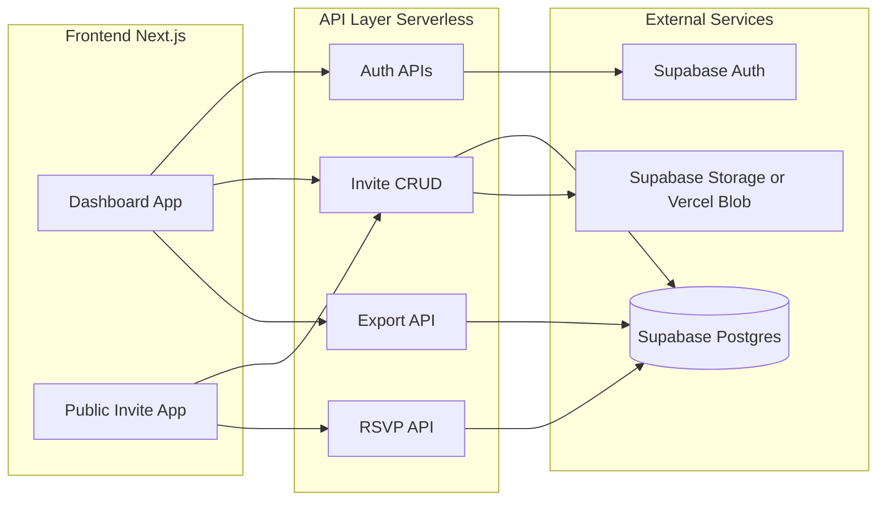
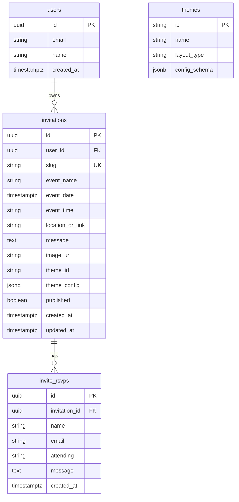

# Multi-Tenant Invitation Platform — Architecture & Implementation Plan

## Current State Summary

- **Single invite:** One public page at `/` with hard-coded title, subtitle, copy, date/time, location, and image path ([app/page.js](app/page.js)).
- **Single "host":** Env-based login ([lib/auth.js](lib/auth.js)); one global RSVP table ([lib/rsvp-store.js](lib/rsvp-store.js), [supabase-invite-rsvps.sql](supabase-invite-rsvps.sql)) with no `invitation_id`.
- **No tenant isolation:** All RSVPs in one table; no users, no per-invitation config.

---

## 1. High-Level System Architecture




- **Frontend:** Next.js App Router. Two logical apps: **Dashboard** (auth-required, manage invitations) and **Public Invite** (unauthenticated, read invite + submit RSVP).
- **Backend:** Next.js API routes (serverless on Vercel). Stateless; all tenant context from JWT/session + DB.
- **Auth:** **Supabase Auth** (recommended). You already use Supabase Postgres; one provider for DB + Auth, RLS for tenant isolation, email/social signup, and no custom session crypto to maintain. Alternative: NextAuth or Clerk if you prefer provider-agnostic or hosted UI.
- **Database:** **Supabase Postgres** (current). Add Prisma (recommended) for type-safe access, migrations, and connection pooling in serverless.
- **Storage:** Supabase Storage or Vercel Blob for uploaded invite images. Store only URLs in DB; support "image URL" field for external images.

---

## 2. Data Model




- **users:** Use Supabase Auth `auth.users`; add `public.profiles` (id, email, display_name, avatar_url) if you need extra fields. No custom password storage.
- **invitations:** One row per invite; `user_id` = owner; `slug` = unique, URL-safe (e.g. `my-wedding-2026`); all display content in DB (event_name, event_date, event_time, location_or_link, message, image_url, theme_id, theme_config). `published` gates visibility on public URL.
- **themes:** Small table or config file: id, name, layout_type, optional config_schema. Start with 1–2 themes; extensible later.
- **invite_rsvps:** Add `invitation_id`; keep name, email, attending, message, created_at. All list/export scoped by `invitation_id` (and indirectly by `user_id` via join).

RLS (Supabase): `invitations` — users see only their rows; `invite_rsvps` — insert allowed for public (with valid invitation_id), select only for invitation owner. Enforce same rules in API for defense in depth.

---

## 3. Routing Strategy


| Purpose             | Route pattern                         | Auth | Notes                                     |
| ------------------- | ------------------------------------- | ---- | ----------------------------------------- |
| Landing / marketing | `/`                                   | No   | Optional; or redirect to login/dashboard. |
| Auth                | `/login`, `/signup`                   | No   | Supabase Auth or hosted UI.               |
| Dashboard           | `/dashboard`                          | Yes  | List invitations, quick actions.          |
| Create invite       | `/dashboard/invitations/new`          | Yes  | Wizard or single form.                    |
| Edit invite         | `/dashboard/invitations/[id]/edit`    | Yes  | Same config form.                         |
| Preview (owner)     | `/dashboard/invitations/[id]/preview` | Yes  | Same as public view, draft allowed.       |
| Public invite       | `/i/[slug]`                           | No   | CDN-friendly, cacheable; slug from DB.    |


- **Why `/i/[slug]`:** Short, clear, and slug-based so it's cacheable and shareable. Resolve slug → invitation in API or in getServerSideProps/server component; 404 if not found or not published.
- **Dashboard layout:** Single layout at `app/(dashboard)/layout.js` that checks auth and redirects to `/login` if unauthenticated; all dashboard routes under this group.
- **Clean separation:** No shared layout between dashboard and public invite; public invite page is a minimal layout (no nav) for maximum flexibility and performance.

---

## 4. Component Refactor Plan


| Current (hard-coded)               | Becomes                                          | Where it lives                                        |
| ---------------------------------- | ------------------------------------------------ | ----------------------------------------------------- |
| Title "You're Invited"             | `invitation.event_name` or theme default         | Public invite page / theme component                  |
| Subtitle "We'd love to celebrate…" | Optional field or theme default                  | Same                                                  |
| Body copy                          | `invitation.message`                             | Same                                                  |
| Date & time                        | `invitation.event_date`, `invitation.event_time` | Same                                                  |
| Location                           | `invitation.location_or_link`                    | Same                                                  |
| Image `/invite-image.jpg`          | `invitation.image_url` (upload or URL)           | Same; Next.js Image with remotePatterns or blob URL |
| Single global RSVP form            | Same form, but POST includes `invitation_id`     | Public invite page                                    |
| Host link "Host: view & download"  | Removed from public page; host uses dashboard    | Dashboard only                                        |


**Configurable (from DB + theme):**

- Event name, date, time, location/link, message, image URL.
- Theme ID + optional `theme_config` (e.g. accent color, font choice) for future theming.
- RSVP form: same fields; backend associates response with `invitation_id`.

**Stays static (app shell):**

- Layout structure of the public invite (e.g. image left, content right) can be driven by `theme_id` (e.g. "classic", "minimal") with 1–2 layout components.
- Form UX (name, email, attending, message), validation, and success/error handling.
- Dashboard shell (header, sidebar or top nav, table, export buttons).

**Refactor steps:**

1. Introduce a **config-driven invite view**: one component that accepts `invitation` (and optional `theme`) and renders title, subtitle, copy, meta, image, and RSVP section. Current [app/page.js](app/page.js) becomes a wrapper that fetches invite by slug and passes config into this component.
2. Replace all literal strings and `/invite-image.jpg` with props from `invitation`.
3. Add `invitation_id` to RSVP submit; ensure API and DB use it.
4. Move host UI entirely into dashboard (list per user, export per invitation or filtered).

---

## 5. Scalability Considerations

- **Multi-tenant safety:** Every query filters by `user_id` (dashboard) or by `invitation_id` (public RSVP). Use parameterized queries only; never concatenate user input into SQL. Supabase RLS as a second layer.
- **Performance:** Public invite by slug is a single row lookup + optional theme; cache with `revalidate` (ISR) or Cache-Control headers (e.g. 60–300s) since published invites change infrequently. RSVP POST is write-through; no long cache. Dashboard APIs are user-scoped and short-lived; no public cache.
- **Stateless APIs:** No in-memory session store; Supabase JWT or cookie-verified session; DB and storage are the source of truth.
- **Cost control:** Supabase free tier for early stage; connection pooling (Prisma or Supabase pooler) to avoid exhausting connections. Image storage: Supabase Storage or Vercel Blob with size/type limits and optional image optimization (Next.js Image).

---

## 6. Incremental Implementation Plan

**Phase 1 — MVP (multi-tenant, single theme)**

- Add Supabase Auth (signup/login); optional `profiles` table.
- Add Prisma (or raw SQL) schema: `invitations` (with slug, all content fields, `user_id`), `invite_rsvps` (add `invitation_id`), migrate existing `invite_rsvps` if needed (e.g. assign to a "default" invite or leave legacy table read-only).
- Implement dashboard layout and auth guard; move current host list/export behind `/dashboard`, scoped to current user's invitations. One "Create invitation" flow (form: event name, date, time, location, message, image URL); generate slug (from name + id or nanoid).
- New public route: `/i/[slug]`. Fetch invitation by slug (and require `published` or allow draft for owner via preview). Config-driven invite component; RSVP POST with `invitation_id`.
- Deprecate or remove root `/` as the single invite; redirect to dashboard or landing. Remove env-based single host auth in favor of Supabase.
- **Deliverable:** Multiple users can sign up, create one invitation each (or more), publish, share `/i/[slug]`, and collect RSVPs per invite; dashboard lists only own invites and exports per invite.

**Phase 2 — Multi-theme**

- Add `themes` table or config (id, name, layout_type). Add `theme_id` and optional `theme_config` to `invitations`.
- Implement 2 layout components (e.g. "classic" = current two-column; "minimal" = single column, image top). Invite view chooses layout by `theme_id` and passes `theme_config` for overrides (e.g. accent color).
- Dashboard: theme selector when creating/editing invite; preview reflects theme.
- **Deliverable:** Invitation creation includes theme choice; public page renders according to theme.

**Phase 3 — Monetization-ready**

- Billing: Stripe (or similar); `subscriptions` or `plans` table linked to `user_id`; enforce limits (e.g. invites per plan, RSVP cap) in API.
- Optional: custom domain per invitation (CNAME + middleware to resolve domain → slug), analytics (views/clicks) stored per invitation, templates marketplace (themes as first-class templates). Paid tiers (basic vs premium) via plan checks in dashboard and API.

---

## 7. Code Patterns & Folder Structure

**Suggested project structure**

```
app/
  (marketing)/           # optional landing
    page.js
  (auth)/
    login/
    signup/
    callback/            # Supabase auth callback
  (dashboard)/
    layout.js            # auth guard, dashboard shell
    dashboard/
      page.js            # list invitations
      invitations/
        new/page.js
        [id]/
          edit/page.js
          preview/page.js
  i/
    [slug]/
      page.js            # public invite (fetch by slug, render config-driven)
  api/
    auth/
    invitations/
      route.js           # GET list (user), POST create
      [id]/
        route.js         # GET one, PATCH, DELETE
      [id]/publish/
      [id]/rsvps/
    rsvp/
      route.js           # POST (body: invitation_id + name, email, attending, message)
    export/
      route.js           # query param invitation_id, user must own
lib/
  auth.js                # Supabase auth helpers / getSession
  db.js                  # Prisma client or Supabase client
  rsvp-store.js          # addRsvp(invitation_id, ...), listRsvps(invitation_id) or listByUser(user_id)
prisma/
  schema.prisma
  migrations/
```

**Example: config-driven invite renderer**

- **Server component** for `/i/[slug]/page.js`: fetch invitation by slug (and optionally theme). If not found or not published, notFound(). Pass `invitation` (and `theme`) to a client component that handles RSVP form state and submit.
- **Shared component** e.g. `InviteView`: receives `invitation` (and `theme`). Renders:
  - Image: `invitation.image_url` (with placeholder if missing).
  - Title: `invitation.event_name` (or theme default).
  - Subtitle: optional from theme or null.
  - Copy: `invitation.message`.
  - Meta: `invitation.event_date`, `event_time`, `location_or_link`.
  - RSVP form: same fields; on submit POST to `/api/rsvp` with `invitation_id: invitation.id` plus name, email, attending, message.
- Theme can switch layout: e.g. `theme.layout_type === 'minimal'` → single-column wrapper; otherwise two-column (current layout). No hard-coded content; all text and image from `invitation`.

---

## Recommendations Summary


| Area         | Recommendation                                                                                                              |
| ------------ | --------------------------------------------------------------------------------------------------------------------------- |
| Auth         | Supabase Auth (aligns with existing Supabase Postgres).                                                                     |
| DB           | Keep Supabase Postgres; add Prisma for schema and migrations.                                                               |
| Storage      | Supabase Storage or Vercel Blob for uploads; store URLs in `invitations.image_url`.                                         |
| Public URL   | `/i/[slug]`; slug unique, resolved in server component or API.                                                              |
| Multi-tenant | `user_id` on all tenant resources; RLS + API checks.                                                                        |
| First step   | Phase 1: Auth + data model + dashboard + single public route with config-driven content and RSVP linked to `invitation_id`. |


This plan avoids hard-coded invitation content, keeps dashboard and public invite clearly separated, and stays serverless- and Vercel-friendly while leaving room for themes, custom domains, and monetization in later phases.
